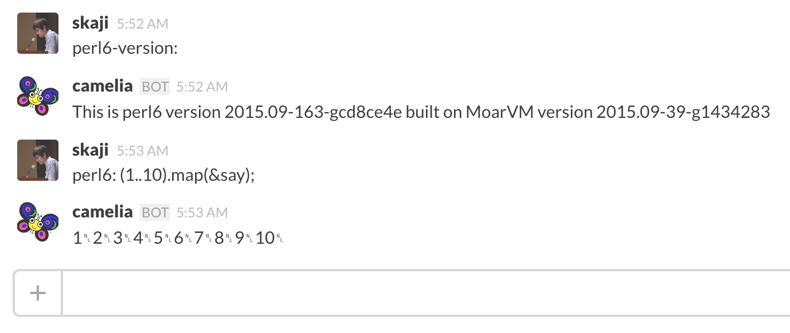

# slack perl6 evalbot

This is a perl6 evalbot for slack. It uses:

* https://github.com/perl6/evalbot
* https://github.com/zostay/AnyEvent-SlackRTM
* https://github.com/shogo82148/p5-AnySan-Provider-Slack

# usage

1. `git clone --recursive git://github.com/shoichikaji/slack-perl6-evalbot.git`
2. Build base docker: `docker build -t evalbot-base -f Dockerfile.base .`
3. Build main docker: `docker build -t evalbot -f Dockerfile .`
4. Get API TOKEN from https://my.slack.com/services/new/bot
5. Choose channel and determine channel id from https://slack.com/api/channels.list?token=XXXXX&pretty=1
6. Then:

        docker run -e SLACK_TOKEN=XXX -e SLACK_CHANNEL_NAME=general -e SLACK_CHANNEL_ID=C06TR4JF9 -d slack-perl6-evalbot

7. Finally mention your bot in the channel!

# how to update perl6

1. Build main docker again: `docker build -t evalbot --no-cache=true .`
2. Stop existing container: `docker stop PREVIOUS_ID`
3. Re-run docker: `docker run -e ... evalbot`

## author

Shoichi Kaji

## license

This library is free software; you can redistribute it and/or modify it under the same terms as Perl5 itself.
